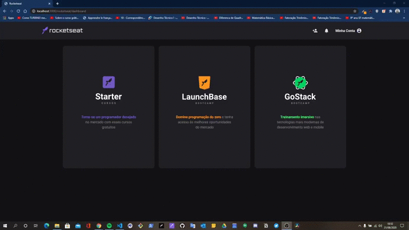

<h3 align="center">
    
    <br><br>
    <b>Rocketseat</b>
    <br><br>
    <p align="center">
        
        
    </p>
</h3>

## 🚀 Sobre
Site baseado na plataforma de ensino da Rocketseat.

## 👷🏾‍♂️ Como usar?

<h4> Você precisa das seguintes ferramentas instaladas para executar este projeto: </h4>
 <p> <a href="https://nodejs.org/en/">Node.js + NPM<a>, <a href="https://www.postgresql.org/download/"> PostgreSQL </a> e <a href="https://www.electronjs.org/apps/postbird"> Postbird. </a> </p>

```bash
# Faça um clone
$ git clone https://github.com/Jacoappolinario/Rocketseat.git

# Navegue até o repositório clonado:
$ cd Rocketseat

# Baixe as dependências:
$ npm install

# Divirta-se
$ npm start
```

## 💻 Resultado



## 📕 Licença
Lançado em 2020 (Trabalho em andamento) Esse projeto está sob a licença MIT. Veja o arquivo [LICENSE](/LICENSE) para mais detalhes.

---

Feito com 💙 by [Jacó Apolinário](https://www.linkedin.com/in/jacoapolinario/)
