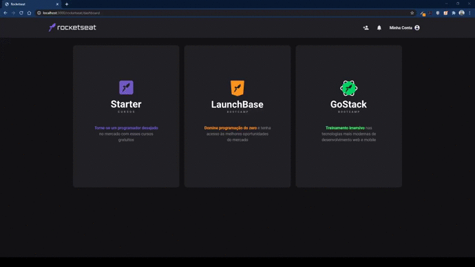

# Rocketseat 

<h1>
    
</h1>

### 📝Sobre

Site baseado na plataforma de ensino da Rocketseat.

----

### 🚩Pré Requisitos

- [Git](https://git-scm.com/).
- [Node](https://nodejs.org).


----

### 📂Instalação

```bash
# Clone este repositório
$ git clone https://github.com/Jacoappolinario/Rocketseat.git

# Vá para o repositório
$ cd Rocketseat

# Instalar dependências
$ npm install

# Execute o aplicativo
$ npm start
```

----

## 🚀Tecnologias

- NodeJs
- Express
- Nodemon
- Nunjucks
- HTML
- CSS
- JS

----

## 👨🏾‍💻Autor
* **Jacó Apolinário** - [Linkedin](https://www.linkedin.com/in/jacoapolinario/)

----

## 🧾License

Esse projeto está sob a licença MIT. Veja o arquivo [LICENSE](/LICENSE) para mais detalhes.

